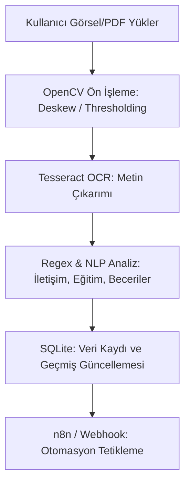

# 📄 Erasmus Staj Projesi: OCR Belge Analiz & Otomasyon Sistemi

Bu proje; yüklenen görsel (PNG, JPG vb.) ve PDF dökümanlarından metin çıkarımı (OCR) yapabilen, döküman içeriklerini (beceriler, eğitim, iletişim bilgileri vb.) akıllı algoritmalarla analiz eden ve elde edilen verileri n8n gibi otomasyon sistemlerine aktaran web tabanlı bir entegrasyon uygulamasıdır.

---

## 🎯 Proje Amacı

- **OCR Belge Tanıma**: Görsellerden ve PDF sayfalarından metin okuma.
- **Akıllı Veri Analizi**: CV/Döküman metinlerinden beceri (skills), e-posta, telefon ve eğitim bilgilerini otomatik ayıklama.
- **SQLite Geçmiş Yönetimi**: Yüklenen son 15 belgeyi yerel veritabanında saklama ve geçmişe kolayca erişme.
- **n8n Otomasyonu**: Analiz çıktılarını tek tıkla n8n iş akışlarına/webhook'larına yönlendirme.
- **Ön İşleme (OpenCV)**: Açı düzeltme (auto-deskew) ve eşikleme gibi görüntü iyileştirme adımlarını dinamik yönetme.

---

## ⚙️ Uygulama Akışı



---

## 🛠️ Kullanılan Teknolojiler

- **Backend**: Python (Flask)
- **OCR & Görüntü İşleme**: Tesseract OCR, OpenCV (cv2)
- **Veritabanı**: SQLite
- **Frontend**: HTML5, Vanilla CSS (Minimalist Vintage Tema), Vanilla JS
- **Otomasyon/Konteyner**: n8n, Docker, docker-compose

---

## 🚀 Projeyi Başlatma

Sunucuyu yerel olarak ayağa kaldırmak için:

```bash
python3 app.py
```

Ardından tarayıcınızda **`http://127.0.0.1:5001`** adresine gidebilirsiniz.
